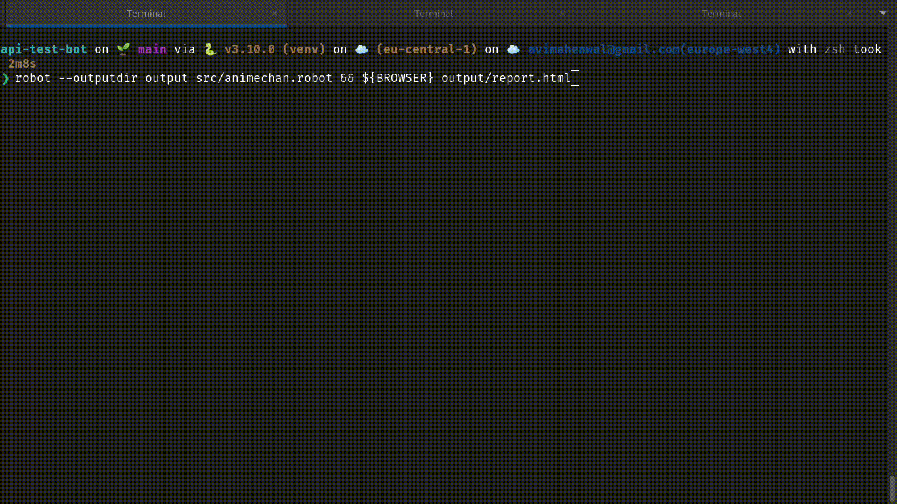

# api-test-bot

API testing bot



[Link to video demo](./docs/test-bot-demo.mp4)

## Features

- [x] entrypoint points automatically open the report based on deafult browser once reports are ready
- [x] Open for Extensability, can add more APIs to test.
- [x] Utlizing advanced PUT Parameterized Unit-testing technique
- [x] Beautyful and easy to understand reports
- [x] Can run tests in Parallel

## How to run

Prepare python virtual environment to run framework

```
python3 -m venv venv
source venv/bin/activate
pip install -r requirements.txt
```

Filter and Run test

```
robot --outputdir output src/animechan.robot
```

### View reports

Reports would be generated under `/output` directory, either use file-manager to open them in browse or if using linux
use the follwong command

```
${BROWSER} output/report.html
```

### More

[Further information about API being tested](./docs/api-documentation-animechan.md)

#### :v: Get in touch with me

> I am looking for Jobs ... :sunglasses:

- [Github](https://github.com/avimehenwal/)
- [My Website](https://avimehenwal.in)
- [My Blog v2](https://avimehenwal2.netlify.app/)
- [Twitter Handle](https://twitter.com/avimehenwal)
- [LinkedIn](https://in.linkedin.com/in/avimehenwal)
- [Stackoverflow](https://stackoverflow.com/users/1915935/avi-mehenwal)

<a href="https://www.buymeacoffee.com/F1j07cV" target="_blank"></a>

Spread Love :hearts: and not :no_entry_sign: hatred [](https://twitter.com/avimehenwal)
